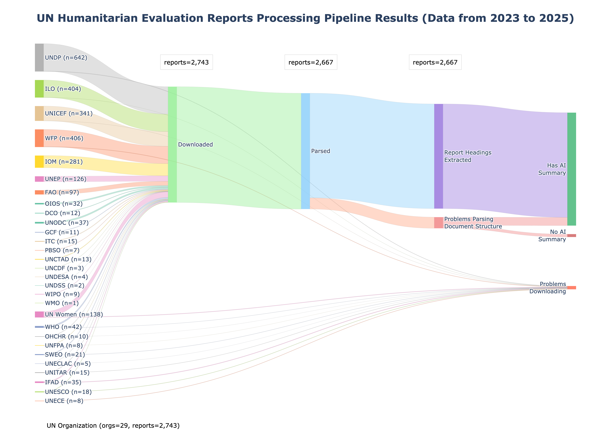

# Humanitarian Evaluation AI Research Pipeline

[](https://www.python.org/downloads/)
[](https://opensource.org/licenses/MIT)
[](https://github.com/psf/black)

A data pipeline for parsing, summarizing, and analyzing humanitarian evaluation reports using AI-powered tools.

As refered in Medium articles:

- [A Low-Cost Pipeline for Generating Abstracts of Humanitarian Evaluation Reports](https://medium.com/@astrobagel/a-low-cost-pipeline-for-generating-abstracts-of-humanitarian-evaluation-reports-4efe231cd4ea)

## Overview

This project provides a streamlined data pipeline for processing humanitarian evaluation reports with the following components:

1. **parse.py** - Parse documents (PDF, DOCX) and extract structured content with table of contents
2. **summarize.py** - Generate extractive and abstractive summaries using embeddings and LLMs
3. **stats.py** - Generate organization statistics and visualizations from parsed documents


**Example Data:**

The `data/` directory includes sample results from processing UNEG evaluation reports (2023 - Nov 2025):

- `pdf_metadata.xlsx` - Processed metadata with parsing, summaries, and statistics
- `pipeline_sankey.png` - Visualization of the data pipeline results




## Prerequisites

- Python 3.11+
- Virtual environment (venv)

## Quick Start

### 1. Set up Virtual Environment

```bash
# Create virtual environment
python3 -m venv .venv

# Activate on macOS/Linux
source .venv/bin/activate

# Activate on Windows
.venv\Scripts\activate
```

### 2. Install Dependencies

```bash
# Install all requirements
pip install -r requirements.txt
```

**Note:** The installation includes torch (~2GB) and related ML libraries for advanced PDF parsing with docling. The `docling-hierarchical-pdf` package provides improved heading hierarchy detection by analyzing PDF bookmarks, numbering patterns, and font styles.

### 3. Prepare Metadata Sheet

**IMPORTANT:** Before running the pipeline, you need to populate a metadata spreadsheet with information about the documents you want to process, as well as placing the documents in the `./data` directory as described below.

#### Create Your Metadata File

1. **Use the sample as a template:**
   ```bash
   # A sample metadata file is provided in data/pdf_metadata_sample.xlsx
   # Copy and rename it to create your own:
   cp data/pdf_metadata_sample.xlsx data/my_metadata.xlsx
   ```

   **Note:** The `data/pdf_metadata.xlsx` file in this repository contains processed UNEG evaluation reports from 2023-Nov 2025 and serves as a complete example of pipeline output. You can examine it to see what the final result looks like, but create your own metadata file for processing your documents.

2. **Required columns:**
   - `Node ID` - Unique identifier for each report
   - `Title` - Report title
   - `Agency` - UN Organization (e.g., WFP, UNICEF, UNHCR)
   - `Year` - Publication year
   - `Filepath` - Path to the PDF/DOCX file (e.g., `./data/pdfs/Agency/Year/filename.pdf`)

3. **Optional but recommended columns:**
   - `Year Published` - Publication year (if different from evaluation year)
   - `Evaluation Type` - Type of evaluation
   - `Country` - Country/countries covered
   - `Region` - Geographic region
   - `SDGs` - Sustainable Development Goals referenced
   - `Theme` - Evaluation theme
   - `Description` - Report description

4. **File structure:**
   Place your PDF/DOCX files in the `data/pdfs/` directory following this structure:
   ```
   data/
   ├── pdfs/
   │   ├── World_Food_Programme/
   │   │   └── 2024/
   │   │       └── Report_Title_12345.pdf
   │   ├── UNHCR/
   │   │   └── 2023/
   │   │       └── Another_Report_12346.pdf
   │   └── ...
   └── pdf_metadata.xlsx  # Your populated metadata file
   ```

**See `data/pdf_metadata_sample.xlsx` for a complete example with sample data.**

### 4. Set Environment Variables

```bash
# Copy example environment file
cp .env.example .env

# Edit .env and add your credentials:
# - HF_TOKEN for LLM summarization (Mistral/Llama via HuggingFace Router API)

# Or export directly:
export HF_TOKEN=your_token_here
```

**HuggingFace API Key (Required for LLM Summarization):**
- Get your token at: https://huggingface.co/settings/tokens
- **IMPORTANT**: Your token must have "Inference Provider" permissions enabled
  - When creating a token, select permissions that include provider access
  - This is required for using third-party inference providers (featherless-ai, novita)
- Add the token to your `.env` file: `HF_TOKEN=hf_...`

### 5. Run the Pipeline

```bash
# 1. Parse documents (extracts text, headings, creates markdown)
python pipeline/parse.py

# 2. Generate summaries (extractive + abstractive with LLMs)
python pipeline/summarize.py

# 3. Generate statistics and visualizations
python pipeline/stats.py
```

## How the Metadata Sheet is Updated

The metadata Excel file (`pdf_metadata.xlsx`) serves as the central tracking system for the entire pipeline. Each stage adds columns and updates values to track progress and results.

### Initial State (Manual Setup)

Before running any pipeline stages, you manually populate the metadata sheet with:

**Required columns:**
- `Node ID` - Unique identifier
- `Title` - Document title
- `Agency` - Organization name
- `Year` - Publication year
- `Filepath` - Path to PDF/DOCX file

**Optional columns:**
- `Year Published`, `Evaluation Type`, `Country`, `Region`, `SDGs`, `Theme`, `Description`

### Stage 1: parse.py - Document Parsing

**Columns Added:**
- `Parsed Folder` - Path to parsed output directory (e.g., `./data/parsed/WFP/2024/Report_12345`)
- `Parsed Markdown Path` - Path to markdown file (e.g., `data/parsed/WFP/2024/Report_12345/Report.md`)
- `TOC` - Table of contents with hierarchical headings (H1-H5)
- `Page Count` - Number of pages in the document
- `Word Count` - Total word count
- `Language` - Detected language (e.g., "en", "fr", "es")
- `File Format` - Document type ("pdf" or "docx")
- `Parsing Error` - Error message if parsing failed (e.g., "Out Of Memory")

**What happens:**
- Reads `Filepath` column to locate documents
- Uses Docling to parse PDFs/DOCX files
- Extracts hierarchical structure and creates markdown
- Detects document language from content
- Updates metadata row with parsing results
- If already parsed (has `Parsed Folder` value), skips unless `--force-parse` is used

**Example Row After Parsing:**
```
| Filepath            | Parsed Folder          | TOC                      | Page Count | Language |
|---------------------|------------------------|--------------------------|------------|----------|
| ./data/.../doc.pdf  | ./data/parsed/WFP/...  | [H1] Executive Summary   | 87         | en       |
|                     |                        | [H1] Introduction...     |            |          |
```

### Stage 2: summarize.py - Summary Generation

**Columns Added:**
- `Key Content Sections` - Path to extracted summary sections (e.g., Executive Summary)
- `Centroid Summary` - Path to extractive centroid-based summary
- `Abstractive Summary (map reduced)` - Path to LLM-generated summary
- `Abstractive Summary Input Method` - How summary was created:
  - `"Key Content Sections (X pages)"` - Used extracted sections
  - `"Centroid Summary"` - Used centroid fallback
  - `"Full Document"` - Summarized entire document
  - `"Full Document (chunked)"` - Used map-reduce chunking
  - `"Executive Summary Section Only"` - Used detected executive summary

**What happens:**
- Reads `Parsed Markdown Path` to load parsed content
- Reads `TOC` to detect summary sections
- Generates multiple summary types:
  1. **Key Content Sections**: Extracts pre-existing summaries from TOC
  2. **Centroid Summary**: Creates extractive summary using embeddings
  3. **Abstractive Summary**: Generates new summary using LLM
- Uses `Language` column to determine if translation is needed
- Translates non-English summaries to English
- Saves summaries as separate text files, stores file paths in Excel
- If already summarized (has summary values), skips unless `--force` is used

**Example Row After Summarizing:**
```
| Key Content Sections           | Centroid Summary              | Abstractive Summary        | Input Method              |
|--------------------------------|-------------------------------|----------------------------|---------------------------|
| data/.../key_content.txt       | data/.../centroid.txt         | data/.../llm_summary.txt   | Key Content Sections      |
|                                |                               |                            | (8 pages)                 |
```

### Stage 3: stats.py - Statistics & Visualization

**Sheets Added:**
- `Stats` - Organization-level statistics table
- `Stats Viz` - Embedded Sankey diagram visualization

**Files Created:**
- `data/pipeline_sankey.png` - Pipeline flow visualization

**What happens:**
- Reads all existing columns from metadata sheet
- Aggregates data by organization:
  - Counts successful parsing (rows with `Parsed Folder`)
  - Counts TOCs (rows with `TOC` content)
  - Counts summaries (rows with `Key Content Sections`)
  - Counts abstractive summaries (rows with `Abstractive Summary`)
  - Calculates average page/word counts
  - Determines year ranges
- Creates new `Stats` tab with organization-level metrics
- Generates Sankey diagram showing document flow through pipeline
- Embeds visualization in `Stats Viz` tab

**Stats Tab Example:**
```
| Organization | Start Year | End Year | Total PDFs | % Parsed | % with TOC | % with Summary |
|--------------|------------|----------|------------|----------|------------|----------------|
| WFP          | 2023       | 2025     | 145        | 98.6%    | 92.4%      | 87.6%          |
| UNICEF       | 2023       | 2025     | 89         | 97.8%    | 88.8%      | 84.3%          |
```

### Column Dependencies

Each stage depends on columns from previous stages:

```
Manual Input → parse.py → summarize.py → stats.py

Filepath     → Parsed Folder      → Key Content Sections    → Stats aggregation
               TOC                 → Centroid Summary
               Page Count          → Abstractive Summary
               Word Count
               Language
               File Format
```

**Best Practice:** Always run the pipeline in order (parse → summarize → stats) to ensure all required columns are populated for subsequent stages.

## Component Details

### parse.py

Parses documents (PDF, DOCX) using Docling with metadata tracking. Reads from the metadata Excel file and tracks parsing progress.

**Features:**
- Uses Docling for high-quality document parsing with hierarchical heading detection
- Integrates `docling-hierarchical-pdf` to infer proper heading hierarchy (H1 → H2 → H3 → H4 → H5)
- Heading hierarchy inferred from:
  - PDF bookmarks/metadata
  - Heading numbering patterns (1, 1.1, 1.1.1, etc.)
  - Font styles (size, bold, italic)
- Tracks parsing status in metadata Excel file
- Creates structured output: `agency/year/document_folder/`
- Supports selective parsing by year or agency
- Automatically adds parsing columns to metadata (parsed_folder, parsed_markdown_path, TOC, etc.)
- **OOM Protection:** Automatic subprocess protection against Out-Of-Memory crashes

**Usage:**

```bash
# Default: Parse all unparsed documents (fast mode, no OCR)
python pipeline/parse.py

# Enable OCR with all supported languages (en, fr, es, pt)
python pipeline/parse.py --ocr

# Enable OCR with accurate table extraction (slower but better quality)
python pipeline/parse.py --ocr --table-mode accurate

# Parse only specific year
python pipeline/parse.py --year 2024

# Parse only specific agency
python pipeline/parse.py --agency "World_Food_Programme"

# Force re-parse all documents matching filters
python pipeline/parse.py --year 2024 --force-parse

# Custom metadata file and output directory
python pipeline/parse.py --metadata ./data/pdf_metadata.xlsx --output ./data/parsed
```

**Docling Options:**
- `--pipeline standard` - Pipeline type (default: standard)
- `--ocr` - Enable OCR (disabled by default for speed)
- `--ocr-engine rapidocr` - OCR engine: rapidocr, easyocr (default: rapidocr)
- `--ocr-lang en,fr,es,pt` - OCR languages (default: en,fr,es,pt)
- `--pdf-backend dlparse_v4` - PDF backend (default: dlparse_v4)
- `--table-mode fast|accurate` - Table extraction mode (default: fast)
- `--enrich-picture-description` - Enable AI picture descriptions (slow)
- `--images-scale 1.0` - Image resolution scale (default: 1.0)

**Memory Optimization & Chunking:**
For large PDFs (200+ pages), the parser automatically uses chunking to prevent memory issues:
- `--chunk-threshold 200` - Minimum pages to trigger chunking (default: 200)
- `--chunk-size 50` - Pages per chunk (default: 50)
- `--chunk-timeout 300` - Timeout per chunk in seconds (default: 300)
- `--disable-chunking` - Disable chunking (not recommended for large PDFs)

**Output:**

```
data/
└── parsed/
    └── <agency>/
        └── <year>/
            └── <document_name>/
                ├── <document_name>.md      # Markdown with page breaks
                ├── <document_name>.json    # Structured JSON
                ├── toc.txt                 # Table of contents
                └── images/                 # Extracted images
```

### summarize.py

Generates multiple types of summaries for parsed documents using sentence embeddings and HuggingFace Inference API with support for multiple LLM models.

**Usage:**

```bash
# Generate all summaries (extractive + abstractive)
python pipeline/summarize.py

# Force re-summarization of all documents (regenerate existing summaries)
python pipeline/summarize.py --force

# Custom metadata file
python pipeline/summarize.py --metadata ./data/custom_metadata.xlsx
```

**Note:** By default, the script skips documents that already have summaries. Use `--force` to regenerate all summaries.

**Requirements:**
- HF_TOKEN environment variable with "Inference Provider" permissions
  - Get token at: https://huggingface.co/settings/tokens
  - **Enable "Inference Provider" permissions** when creating the token
  - Required for using third-party inference providers (featherless-ai for Mistral, novita for Llama)
- **All models use HuggingFace Inference API** - no local installations or GPU required
- Fast and lightweight - models run on HuggingFace's servers

**Summary Types:**

1. **Key Content Sections** - Detected summary sections from TOC
   - **Detection Method**: Uses `sentence-transformers` (all-MiniLM-L6-v2 model) for semantic similarity
   - **Target Terms**: Detects sections similar to:
     - "Executive Summary"
     - "Report Summary"
     - "Abstract"
     - "Overview"
     - "Key Findings"
     - "Main Findings"
     - "Conclusions"
   - **Similarity Threshold**: 65% (catches variations like "Summary of Findings", "Report Overview", etc.)
   - **Multilingual Support**: Automatically translates TOC to English before analysis
   - **Output Format**: Verbatim TOC lines with page numbers (e.g., "[H1] Executive summary | page 10")
   - **Multiple Matches**: If document has multiple summary sections, all are listed on separate lines
   - **Values**: Shows detected headings, "No" if none found, or "No TOC" if table of contents missing

2. **Extractive Summary (using summary TOC sections)** - Extract from identified summary sections
   - Uses summary sections detected in "Key Content Sections" column
   - Extracts full content from detected sections (Executive Summary, Abstract, etc.)
   - Includes all subsections up to the next major heading
   - No length limit - preserves complete original text
   - Removes excessive line breaks for cleaner output
   - **Storage**: Content saved to `<document_name>_key_content_sections.txt` in parsed directory

3. **Extractive Summary (using centroid distance)** - Centroid-based extractive summarization
   - Analyzes entire markdown document
   - Selects 30 most representative sentences using sentence embeddings
   - Fast, works on any document length
   - Filters out tables and page breaks
   - Cleans excessive whitespace and blank lines
   - **Storage**: Content saved to `<document_name>_centroid.txt` in parsed directory

4. **Abstractive Summary Input Method** - Tracks which content was used for LLM summarization
   - **"Using TOC summary sections content"** - LLM used content from detected summary sections
   - **"Using Centroid Content"** - LLM fell back to centroid-based key sentences
   - **"Using Full Content"** - LLM used entire markdown document (last resort)
   - Helps understand the quality and source of LLM summaries

5. **Abstractive Summary (concatenating chunk summaries)** - Intermediate chunk summaries (map-reduce only)
   - Only populated for documents that exceed model context window
   - Contains the combined summaries from individual chunks before final reduction
   - Shows the MAP phase output
   - Automatically translated to English if document is non-English
   - **Storage**: Content saved to `<document_name>_llm_chunked_summary.txt` in parsed directory

6. **Abstractive Summary (map reduced)** - Final LLM summary
   - Final summary from configured LLM model via HuggingFace Inference API
   - **Supported Models:**
     - `facebook/bart-large-cnn` - Fast, 4K character context
     - `mistralai/Mistral-7B-Instruct-v0.2` - Larger context (32K chars)
     - `meta-llama/Llama-3.1-8B-Instruct` - 8K character context
   - **LLM Input Priority:**
     1. Uses "Extractive Summary (using summary TOC sections)" if available
     2. Falls back to "Extractive Summary (using centroid distance)" if summary sections are empty
     3. Uses full markdown content if centroid is also empty
   - Automatically translated to English if document is non-English
   - Always generated by default
   - **Storage**: Content saved to `<document_name>_llm_summary.txt` in parsed directory

**LLM Summarization Process:**

The script automatically detects the model type and applies the appropriate summarization strategy.

**For documents within model context window (single-pass):**
```
Input → LLM API → Final Summary
```

**For documents exceeding context window (map-reduce):**
```
Input (e.g., 100,000 chars)
    ↓
Split into chunks (with overlap)
    ↓
MAP: Summarize each chunk in parallel
    ↓
Chunk Summaries Combined → "Abstractive Summary (concatenating chunk summaries)"
    ↓
Check if combined still exceeds context window
    ↓ (if yes)
Second round of map-reduce on combined text
    ↓
REDUCE: Final summarization pass
    ↓
Final Summary → "Abstractive Summary (map reduced)"
```

**Translation:**
- LLM summaries are automatically translated to English for non-English documents
- Uses the Language column (populated by `parse.py`) to detect document language
- Translation uses Google Translate via `deep-translator` library
- Handles long texts by chunking (max 5000 chars per chunk)
- If translation fails, original summary is retained
- English documents (Language = "en", "eng", or "english") skip translation

**Output:**
- Updates metadata Excel file with summary columns
- All LLM summaries in English regardless of source document language
- Summaries saved as file paths in Excel (actual content in separate .txt files)
- Skips already-summarized documents unless `--force` is used
- Progress saved after each document

**Model Configuration:**

The LLM model is configured at the top of `summarize.py`:

```python
# Option 1: BART (4K context, fast summarization)
# LLM_MODEL = {
#     "model": "facebook/bart-large-cnn",
#     "provider": "hf-inference",
#     "max_context_chars": 4000,
#     "max_tokens": 1024,
#     "chunk_overlap": 400,
#     "chunk_tokens_ratio": 0.5,
# }

# Option 2: Mistral (32K context, better quality)
# LLM_MODEL = {
#     "model": "mistralai/Mistral-7B-Instruct-v0.2:featherless-ai",
#     "provider": "featherless-ai",
#     "max_context_chars": 29000,
#     "max_tokens": 2000,
#     "chunk_overlap": 800,
#     "chunk_tokens_ratio": 0.5,
# }

# Option 3: Llama (8K context) - DEFAULT
LLM_MODEL = {
    "model": "meta-llama/Llama-3.1-8B-Instruct:novita",
    "provider": "novita",
    "max_context_chars": 29000,
    "max_tokens": 2000,
    "chunk_overlap": 800,
    "chunk_tokens_ratio": 0.5,
}
```

**To switch models**, simply uncomment the desired model configuration in the `LLM_MODEL` dictionary in `pipeline/summarize.py`.

### stats.py

Generates organization statistics from parsed metadata.

**Features:**
- Creates a "Stats" tab in the metadata Excel file (positioned to the right of existing tabs)
- Uses "Key Content Sections" column (populated by `summarize.py`) to determine if documents have summary sections
- Calculates success rates by organization (parsing, TOC, summary sections)
- Displays year ranges and comprehensive metrics per organization
- **Creates Sankey diagram visualization** showing data flow through pipeline stages

**Usage:**

```bash
# Generate stats for default metadata file
python pipeline/stats.py

# Or specify custom metadata file
python pipeline/stats.py --metadata ./data/custom_metadata.xlsx
```

**Stats Tab Columns:**
1. Organization
2. Start Year (earliest report year)
3. End Year (latest report year)
4. Total Number of PDFs
5. % PDFs Parsed Successfully
6. Number of PDFs Parsed Successfully
7. % PDFs with Table of Contents
8. Number of PDFs with Table of Contents
9. % PDFs with Summary Section (from summarize.py detection)
10. Number of PDFs with Summary Section
11. % PDFs with Abstractive Summary
12. Number of PDFs with Abstractive Summary
13. Average Number of Pages per PDF (calculated from Page Count column)
14. Average Number of Words per PDF (calculated from Word Count column)

**Visualizations:**
- **Sankey Diagram**: Visual representation of data flow through the pipeline
  - Shows how documents flow from organization → parse → TOC → summary
  - Saved as `data/pipeline_sankey.png`
  - Embedded in "Stats Viz" tab in the Excel file
  - Requires `plotly` and `kaleido` packages
  - **Example**: See `data/pipeline_sankey.png` for visualization of UNEG reports (2023-Nov 2025)

**Notes:**
- Run `summarize.py` first to populate the summary columns
- Statistics are generated based on data in the metadata sheet

## Data Pipeline Workflow

### Complete Pipeline

```bash
# 1. Prepare metadata file (manual step)
# - Create data/pdf_metadata.xlsx with your reports
# - See data/pdf_metadata_sample.xlsx for example
# - Place PDF/DOCX files in data/pdfs/Agency/Year/

# 2. Parse documents
python pipeline/parse.py

# 3. Generate summaries
python pipeline/summarize.py

# 4. Generate statistics
python pipeline/stats.py
```

## Project Structure

```
humanitarian-evaluation-ai-research/
├── pipeline/
│   ├── parse.py           # PDF/DOCX parser
│   ├── summarize.py       # Summary generator
│   └── stats.py           # Statistics generator
├── data/
│   ├── pdf_metadata_sample.xlsx  # Sample metadata structure
│   ├── pdf_metadata.xlsx         # Example: UNEG reports 2023-Nov 2025
│   ├── pipeline_sankey.png       # Example: Sankey visualization
│   ├── pdfs/                     # Your PDF/DOCX files
│   │   └── <Agency>/
│   │       └── <Year>/
│   │           └── <filename>.pdf
│   ├── parsed/                   # Parsed output (generated)
│   │   └── <Agency>/
│   │       └── <Year>/
│   │           └── <document_name>/
│   │               ├── *.md
│   │               ├── *.json
│   │               ├── toc.txt
│   │               └── images/
│   └── summaries/                # Centralized summaries (generated)
├── requirements.txt       # Python dependencies
├── .env                   # Environment variables (create this)
└── README.md             # This file
```

## Configuration

### Environment Variables

| Variable | Default | Description |
|----------|---------|-------------|
| HF_TOKEN | - | HuggingFace API token with "Inference Provider" permissions (required for LLM summarization) |

### Customization

#### Heading Detection (parse.py)

The parser uses Docling's hierarchical postprocessor to automatically detect heading hierarchy from:
- PDF bookmarks/table of contents
- Heading numbering patterns (1, 1.1, 1.1.1, etc.)
- Font styles (size, bold, italic)

No manual configuration needed - it works automatically!

#### Embedding Model (summarize.py)

Change the model at the top of `pipeline/summarize.py`:

```python
EMBEDDING_MODEL = "all-MiniLM-L6-v2"
```

Available models: https://www.sbert.net/docs/pretrained_models.html

#### LLM Model (summarize.py)

Change the model at the top of `pipeline/summarize.py`:

```python
# Uncomment one of these options:

# Option 1: BART (fast, 4K context)
# LLM_MODEL = {...}

# Option 2: Mistral (better quality, 32K context)
# LLM_MODEL = {...}

# Option 3: Llama (default, 8K context)
LLM_MODEL = {...}
```

## Troubleshooting

### Missing Dependencies

```bash
# Rebuild virtual environment
rm -rf .venv
python3 -m venv .venv
source .venv/bin/activate  # or .venv\Scripts\activate on Windows
pip install -r requirements.txt
```

### Memory Issues (Large PDFs)

The parser automatically handles large PDFs (200+ pages) by:
1. Splitting into chunks
2. Processing each chunk separately
3. Merging results seamlessly

If you still encounter memory issues:
- Reduce `--chunk-size` (default: 50)
- Lower `--chunk-threshold` (default: 200)
- Close other applications to free memory

### Language Detection Issues

If language detection fails:
- Make sure the PDF has extractable text (not just scanned images)
- Enable OCR with `--ocr` flag if documents are scanned
- Check that OCR languages include your document's language

### LLM API Errors

If LLM summarization fails:
- Verify your HF_TOKEN has "Inference Provider" permissions
- Check your internet connection
- Try a different model (BART, Mistral, or Llama)
- Check HuggingFace status page for API outages

## Performance Tips

1. **Batch Processing**: Process PDFs in batches for large collections
2. **Disable OCR**: Skip `--ocr` flag for documents with extractable text (faster)
3. **Use Fast Table Mode**: Use `--table-mode fast` instead of accurate (faster)
4. **Centroid Summaries**: Use centroid-based extractive summaries for quick previews

## License

MIT License - See LICENSE file for details

## Support

For issues and questions, please open a GitHub issue.
